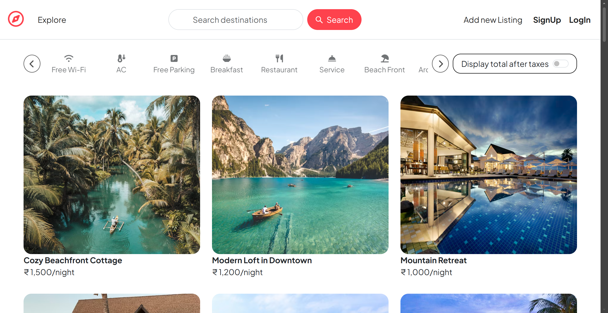
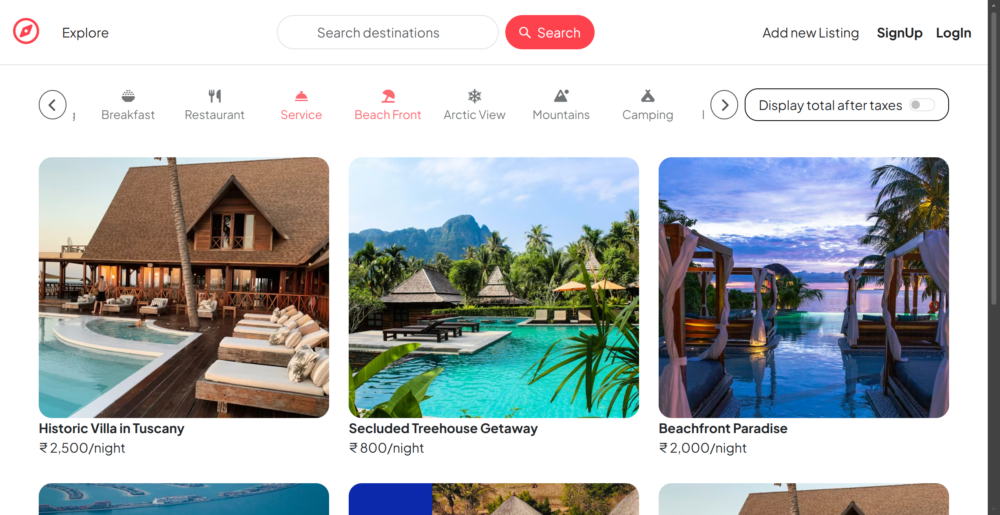
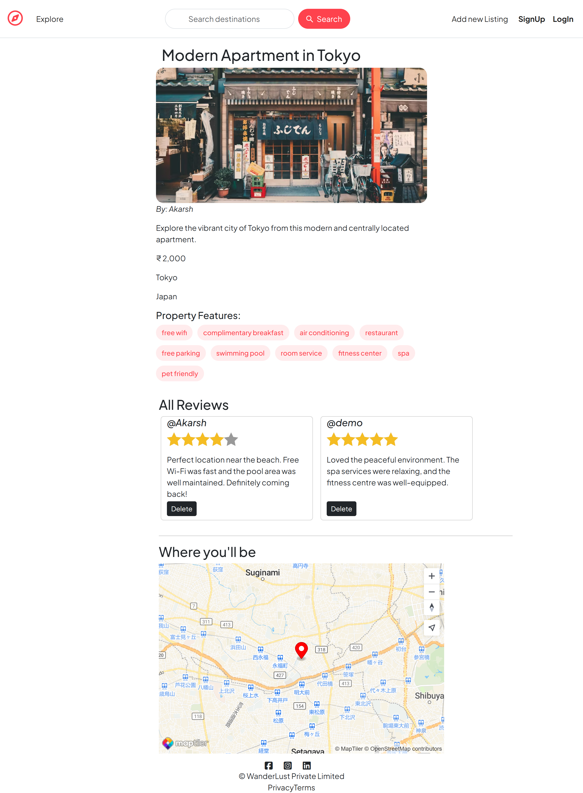
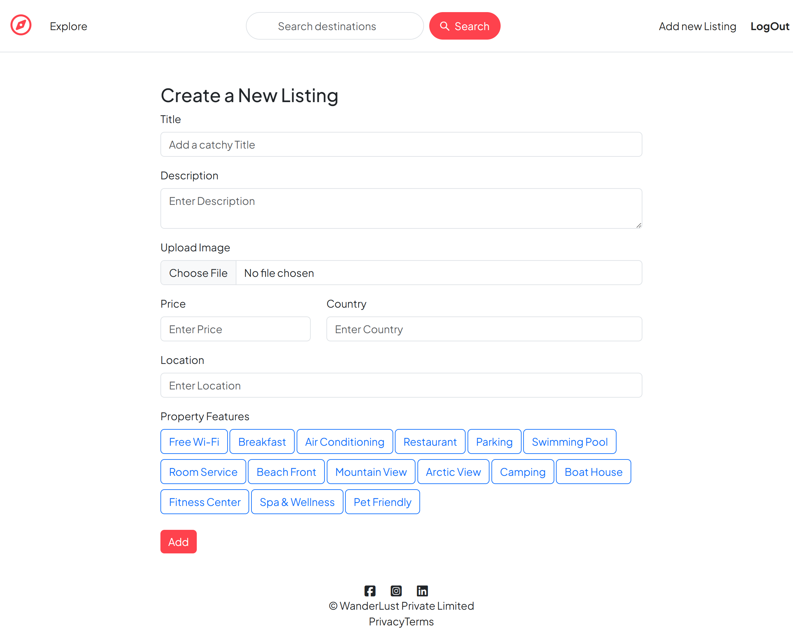
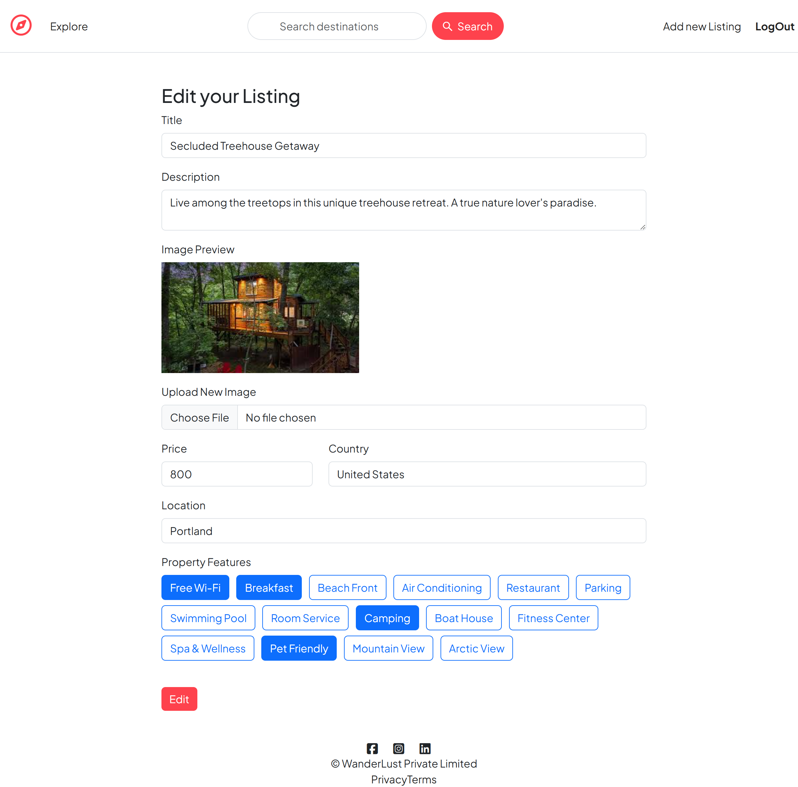
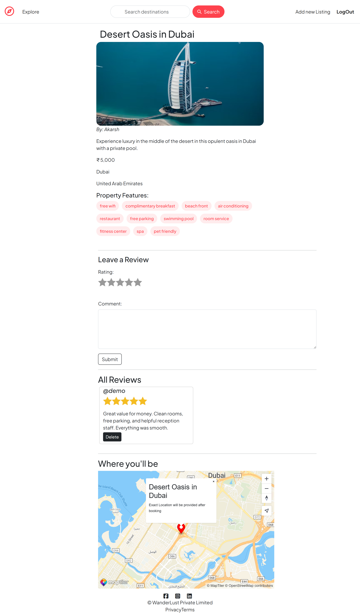

# 🌍 Wanderlust

Wanderlust is a full-stack travel listing web application inspired by modern accommodation booking platforms like Airbnb. Users can explore destinations, create and manage property listings, upload images to cloud storage, leave reviews, and securely authenticate using session-based login.

The application follows a clean MVC architecture and integrates MongoDB Atlas for cloud database management, Cloudinary for image storage, and Passport for authentication.

> 🎓 Developed while learning full-stack web development under the guidance of Apna College.
---

## ✨ Features

* 🔐 User Authentication (Register/Login/Logout)
* 🏡 Create, Edit, and Delete Listings
* ⭐ Add and Manage Reviews
* 🗂 Category-based Filtering
* 🔎 Search Functionality
* 💾 MongoDB Atlas Cloud Database Integration
* 🧠 Persistent Session Storage (MongoDB Session Store)
* 📱 Responsive UI with EJS Templates
* ⚡ Flash Messages & Error Handling

---

## 🛠 Tech Stack

**Frontend**

* EJS
* Bootstrap
* CSS

**Backend**

* Node.js
* Express.js

**Database**

* MongoDB Atlas
* Mongoose

**Authentication & Sessions**

* Passport.js (passport + passport-local)
* express-session
* connect-mongo

---

## 📂 Project Structure

```
MajorProject/
│
├── controllers/        # Route controller logic
├── init/               # Database seeding scripts
├── models/             # Mongoose schemas & models
├── routes/             # Express route definitions
├── views/              # EJS templates
├── public/             # Static assets (CSS, JS, images)
├── Screenshots/        # Project preview images
├── utils/              # Custom error handlers & utilities
│
├── app.js              # Main application entry point
├── cloudConfig.js      # Cloud storage configuration
├── middleware.js       # Custom middleware functions
├── Schema.js           # Joi validation schemas
├── .env                # Environment variables
├── package.json        # Project metadata & dependencies
└── package-lock.json   # Dependency lock file
```

---

## 🚀 Getting Started

### 1️⃣ Clone the Repository

```bash
git clone https://github.com/your-username/wanderlust.git
cd wanderlust
```

### 2️⃣ Install Dependencies

```bash
npm install
```

### 3️⃣ Setup Environment Variables

Create a `.env` file in the root directory:

```
CLOUD_NAME=your_cloudinary_cloud_name
CLOUD_API_KEY=your_cloudinary_api_key
CLOUD_API_SECRET=your_cloudinary_api_secret

MAP_API_KEY=your_map_api_key

ATLASDB_URL=your_mongodb_atlas_connection_string

SECRET=your_session_secret
```

### 4️⃣ Seed Sample Data (Optional)

```bash
node init/index.js
```

### 5️⃣ Run the Application

```bash
node app.js
```

App runs on:

```
http://localhost:8080
```

---

## 🧭 Usage

* Register a new account
* Create travel listings
* Add reviews to listings
* Filter and search properties
* Manage your own listings securely

---
## 🖼 Preview
### 🏠 Application Interface Overview
<table align="center"> <tr> <td align="center" width="50%">
🏠 Homepage

<br><br>
🔍 Filtered Homepage

<br><br>
👀 Show Page

<br><br>
➕ Create Listing Page

<br><br>
✏ Edit Listing Page
 </td> <td align="center" width="50%">
🏠 Full Homepage View
 </td> </tr> </table>

### 👀 Show Page Comparison
<table align="center"> <tr> <td align="center" width="50%">
🚫 Without Login
 </td> <td align="center" width="50%">
🔐 Logged In User
 </td> </tr> </table>

---
## ☁️ Deployment

The application is deployed using modern cloud infrastructure to ensure scalability, reliability, and performance.

**Render** 
– Hosts the Express.js backend server and manages production deployment.

**MongoDB Atlas** 
– Cloud-hosted NoSQL database for storing users, listings, reviews, and session data.

**Cloudinary** 
– Cloud-based image storage and optimisation for listing uploads.

---

## 🌐 Website Link

Live Demo: https://wanderlust-0aaf.onrender.com/listings

---

## 📦 Modules Used

### 🌐 Backend & Server
* express – Fast and minimal web framework for Node.js
* mongoose – Elegant MongoDB object modelling
* mongodb – Official MongoDB driver
* method-override – Enables PUT & DELETE methods in forms

### 🗄 Database & Sessions
* connect-mongo – Stores session data in MongoDB
* express-session – Session middleware for authentication
* dotenv – Manages environment variables securely

### 🔐 Authentication & Security
* passport – Authentication middleware
* passport-local – Username & password authentication strategy
* passport-local-mongoose – Simplifies user authentication with Mongoose
* connect-flash – Flash messages for login/signup alerts

### 🖼 File Upload & Cloud Storage
* multer – Middleware for handling file uploads
* cloudinary – Cloud image storage and optimisation
* multer-storage-cloudinary – Direct image upload to Cloudinary

### 📄 Templating & Frontend Rendering
* ejs – Embedded JavaScript templating engine
* ejs-mate – Layout support for EJS (like template inheritance)

### 📡 API & Utilities
* axios – Promise-based HTTP client for API requests
* joi – Data validation for request body and forms

---

## 👨‍💻 Author

**Akarsh Kumar**\
Full-Stack Web Developer (Learning Phase 🚀)\
Passionate about building scalable backend systems & real-world applications 🚀

---

## 📜 License

This project is licensed under the MIT License.

---
⭐ If you found this project helpful, consider giving it a star on GitHub!
